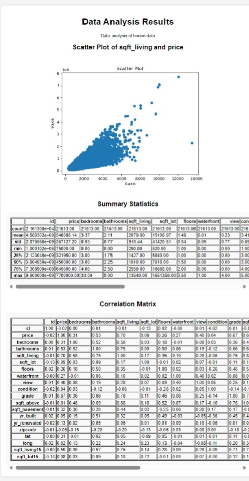

# Data Analysis Proof of Concept Project

Welcome to the Data Analysis Proof of Concept Project! This project serves as a demonstration of data analysis, statistical analysis, and visualization using Flask, Docker, matplotlib and Pandas.

## This is what you get at your localhost:5000



## Tech Stack

### Flask
- A web framework for building and serving the data analysis application.
- Flask allows you to create web applications in Python.

### Docker
- A containerization platform to ensure a consistent and isolated environment for your application.
- Simplifies deployment by encapsulating the application and its dependencies in a container.

### Pandas
- A powerful data manipulation and analysis library for Python.
- Used for loading and analyzing datasets in this project.

### Matplotlib
- A popular plotting library for Python.
- Utilized for creating visualizations, such as scatter plots.

## Project Structure

```
da-flask-docker
│   .dockerignore
│   .gitignore
│   app.py ------------ this is main app file
│   compose.yaml
│   Dockerfile
|   requirements.txt
│   environment.yml --- conda env file
│   README.Docker.md
│   README.md
│
├───data
│       kc_house_data.csv
│
├───scripts
│       analyze_data.py
│   
│
├───static
│   │   scatter_plot.png
│   │
│   └───css
│           style.css
│
├───templates  
        index.html

```

## How to Use

### Installation

1. Install the required Python packages. It's recommended to use a virtual environment:
   
   ```bash
   python -m venv venv
   source venv/bin/activate  # On Windows, use 'venv\Scripts\activate'
   pip install -r requirements.txt
   ```
   *note* - python 3.12 is recommended

- or, Install the Conda environment:

   ```bash
   conda env create -f environment.yml
   conda activate python-flask
   ```

### Running

If you prefer to run the application without Docker, follow these steps:

1. Make sure you have activated your virtual environment:

   ```bash
   source venv/bin/activate
   ```
   On Windows, use 
   ```
   venv\Scripts\activate
   ```

   Or if using Conda:

   ```bash
   conda activate python-flask
   ```

2. Run the Flask application:

   ```bash
   python app.py
   ```

3. Open your web browser and go to [http://localhost:5000](http://localhost:5000) to access the application.

### Analyzing Data

1. The data analysis script is located in `scripts/analyze_data.py`.
2. Customize the analysis as needed in the `analyze_data` function.
3. Run the script:

   ```bash
   python scripts/analyze_data.py
   ```

   This will generate summary statistics, correlation matrices, and a scatter plot.

## How to Use with docker

### Installation

1. Install Docker: [Docker Installation Guide](https://docs.docker.com/get-docker/)
2. Clone the repository:

   ```bash
   git clone https://github.com/your-username/da-flask-docker.git
   ```

3. Change to the project directory:

   ```bash
   cd da-flask-docker
   ```

4. Build and run the Docker container:

   ```bash
   docker-compose up --build
   ```

   Your application will be available at [http://localhost:5000](http://localhost:5000).


### Deploying to the Cloud

1. Build your Docker image:

   ```bash
   docker build -t myapp .
   ```

2. If your cloud uses a different CPU architecture, specify the platform:

   ```bash
   docker build --platform=linux/amd64 -t myapp .
   ```

3. Push the image to your registry:

   ```bash
   docker push myregistry.com/myapp
   ```

   Replace `myregistry.com` with your actual registry.

Consult Docker's [getting started](https://docs.docker.com/go/get-started-sharing/) docs for more details on building and pushing.

## References

* [Docker's Python Guide](https://docs.docker.com/language/python/)